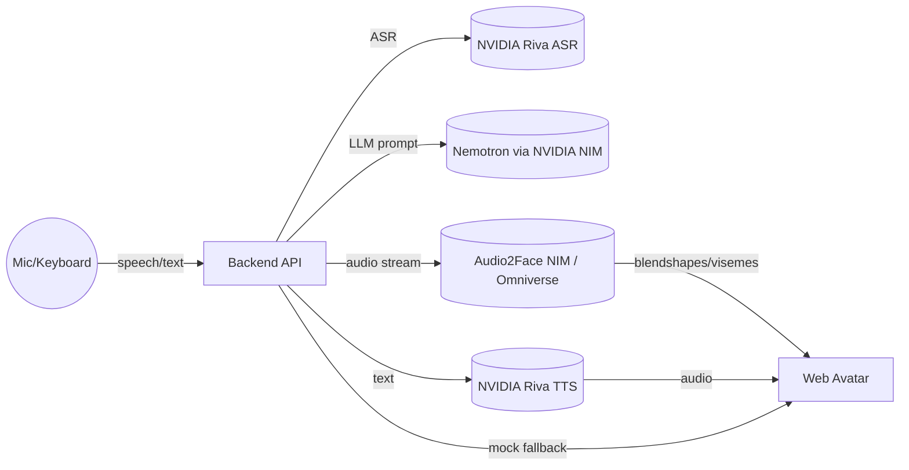

# Digital Humans as AI Agents — NVIDIA ACE–Inspired Demo

**One-command demo** you can run locally (MOCK mode), plus **drop-in connectors** for NVIDIA services (REAL mode).
- Speech → (Riva ASR)
- Intelligence → (Nemotron LLM via NVIDIA NIM)
- Facial animation → (Audio2Face NIM/Omniverse)
- Rendering → (simple 2D avatar here; swap for your 3D rig or Omniverse)

> This repo is designed for portfolio/LinkedIn: clean architecture, clear README, and a short demo you can screen-record.  
> MOCK mode works on any machine. REAL mode needs an NVIDIA GPU and access to the services below.

## ✨ What you’ll show in a demo
1. Speak or type a question.  
2. Digital human responds (text + voice placeholder in MOCK mode) while the mouth animates with visemes.  
3. Swap env vars to use Riva/Nemotron/Audio2Face for a real enterprise-grade pipeline.

## 🧱 Architecture (high level)



- **Tokkio NVIDIA AI Blueprint** (reference pipeline): https://github.com/NVIDIA-AI-Blueprints/digital-human  
- **NVIDIA ACE overview**: https://docs.nvidia.com/ace/latest/index.html  
- **NVIDIA NIM microservices**: https://www.nvidia.com/en-us/ai-data-science/products/nim-microservices/  
- **Riva Speech AI**: https://developer.nvidia.com/riva  
- **Nemotron models**: https://www.nvidia.com/en-us/ai-data-science/foundation-models/nemotron/  
- **Audio2Face NIM**: https://docs.nvidia.com/ace/audio2face-3d-microservice/latest/text/getting-started/overview.html  

## 🚀 Quickstart (MOCK mode — no GPU required)

```bash
# 1) Python env
python -m venv .venv && source .venv/bin/activate  # Windows: .venv\Scripts\activate
pip install -r backend/requirements.txt

# 2) Run API
uvicorn backend.app:app --reload --port 8000

# 3) Open the UI (just open the HTML file)
# Option A: double-click frontend/index.html
# Option B: serve it with Python
python -m http.server 5173 -d frontend
# then navigate to http://localhost:5173
```

- Click the mic 🎙️ and speak (if browser asks, allow mic). Or type into the chat box.
- The avatar mouth will animate using **mock visemes** and a soft “beep” audio placeholder.

## 🔌 REAL mode (plug in NVIDIA services)

Set these in `.env` (copy from `.env.example`).

```bash
# LLM via NIM (Nemotron or your chosen model endpoint)
NIM_LLM_URL=https://YOUR-NIM-LLM-ENDPOINT/v1/chat/completions
NIM_LLM_API_KEY=...

# Riva endpoints (ASR + TTS)
RIVA_ASR_URL=grpc://YOUR-RIVA-ASR:50051
RIVA_TTS_URL=grpc://YOUR-RIVA-TTS:50051

# Audio2Face NIM / Omniverse Kit
A2F_URL=http://A2F-HOST:PORT/blendshapes
```

Then replace the mock adapters in `backend/services/*.py` with the real clients (stubs already provided).  
You can deploy NVIDIA NIM containers on any NVIDIA GPU machine (workstation, data center, or cloud).

## 🧪 What’s included
- `backend/` FastAPI with adapters for ASR, LLM, TTS, and A2F (mock + real stubs).
- `frontend/` Lightweight web UI with a **2D mouth rig** that animates from visemes.
- `docker-compose.yml` skeleton (commented services for NIM/Riva/A2F).
- `docs/` Assets for your LinkedIn post (template + architecture PNG).

## 📸 Screenshots / Video
- Start the API, open the UI, ask a question like “What’s your return policy?” — record a 20–30s clip.
- Post on LinkedIn with the included template (see `docs/LinkedIn-post-template.md`).

## ⚠️ Notes
- MOCK mode uses a generated tone for audio and heuristic visemes; it’s purely demo-friendly.  
- For production, use **Riva streaming ASR/TTS** and **A2F** blendshapes for accurate lip-sync.

## 🏷️ License
MIT — use this as a portfolio starter or extend for your capstone.

